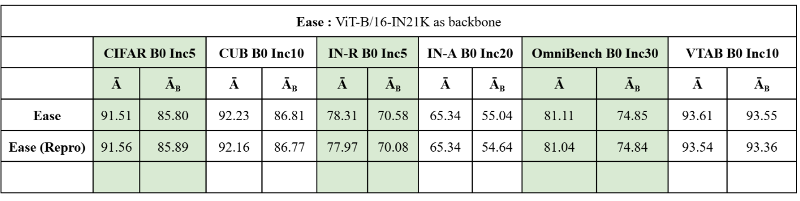
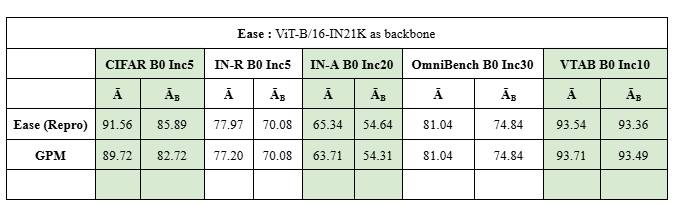

# Expandable Subspace Ensemble (EASE) + Gradient Projection Memory (GPM)

This repository provides:
- **EASE (Expandable Subspace Ensemble)**: A method proposed for continual learning with adapters, enabling model growth while preserving performance on previously learned tasks. (*CVPR 2024*)
- **GPM (Gradient Projection Memory)**: A complementary technique that identifies and protects important subspaces in the parameter space to mitigate catastrophic forgetting. (*ICLR 2021*)

By integrating GPM into the EASE pipeline, we aim to further enhance the adapter-based continual learning process.

## References

- **EASE (Expandable Subspace Ensemble)**  
  - *Paper:* Expandable Subspace Ensemble for Continual Learning  
    [GitHub Link](https://github.com/sun-hailong/CVPR24-Ease) | [ArXiv Link](https://arxiv.org/abs/2403.12030) 
  - *Conference:* CVPR 2024

- **GPM (Gradient Projection Memory)**  
  - *Paper:* Gradient Projection Memory for Continual Learning  
    [GitHub Link](https://github.com/sahagobinda/GPM) | [ArXiv Link](https://arxiv.org/abs/2103.09762)  
  - *Conference:* ICLR 2021

## Repository Structure

- `logs/`: Contains log files and results obtained by reproducing the original EASE method.
- `logs_GPM/`: Contains log files and results obtained after applying GPM to EASE.
- `ease.py`: Modified script to integrate GPM logic into EASE’s training pipeline.
- `gpm.py`: GPM implementation to be added to EASE’s `models` directory.
- `vit_ease.py`: Modified Vision Transformer backbone that supports EASE + GPM.

## Getting Started

### 1. Clone the EASE Repository

First, ensure you have the original EASE repository cloned locally.


### 2. Integrate GPM into EASE
From this repository (the one you are currently viewing), copy the following files into the EASE repository you just cloned:

gpm.py:
Place this file into the EASE models directory:

Copy code
```bash

cp path/to/this_repo/gpm.py <EASE_REPOSITORY_DIRECTORY>/models/

```

ease.py:
Replace the existing ease.py in the EASE repository with the modified version provided here:

Copy code
``` bash
cp path/to/this_repo/ease.py <EASE_REPOSITORY_DIRECTORY>/models/
```

vit_ease.py:
Replace the existing vit_ease.py in the EASE repository’s backbone directory with the modified version:

Copy code
``` bash
cp path/to/this_repo/vit_ease.py <EASE_REPOSITORY_DIRECTORY>/backbone/
```

These changes incorporate the GPM logic into EASE’s adapter-based continual learning framework.

### 3. Running the Modified EASE + GPM Setup
Once the files are in place, you can run your EASE training scripts as usual. The integrated GPM logic will:

Collect layer-wise representations.
Compute significant subspace directions using SVD and thresholding.
Project gradients to minimize interference with previously learned knowledge.
The logs_GPM folder provides a reference for the expected outcomes and performance metrics after GPM integration.

Results





These figures illustrate how GPM integration helps maintain or improve performance compared to baseline EASE runs.


